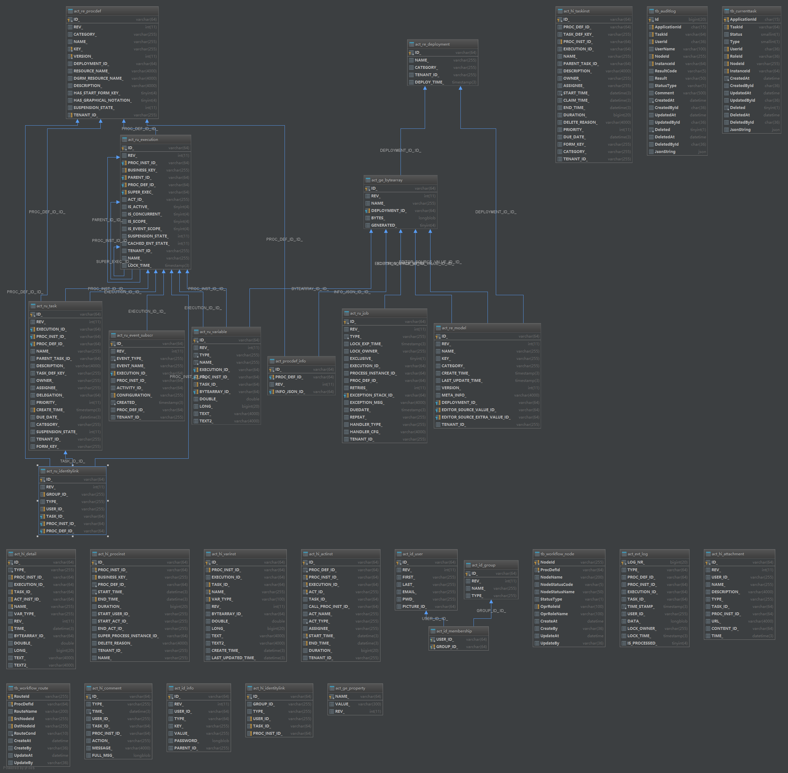

##### 一、核心表

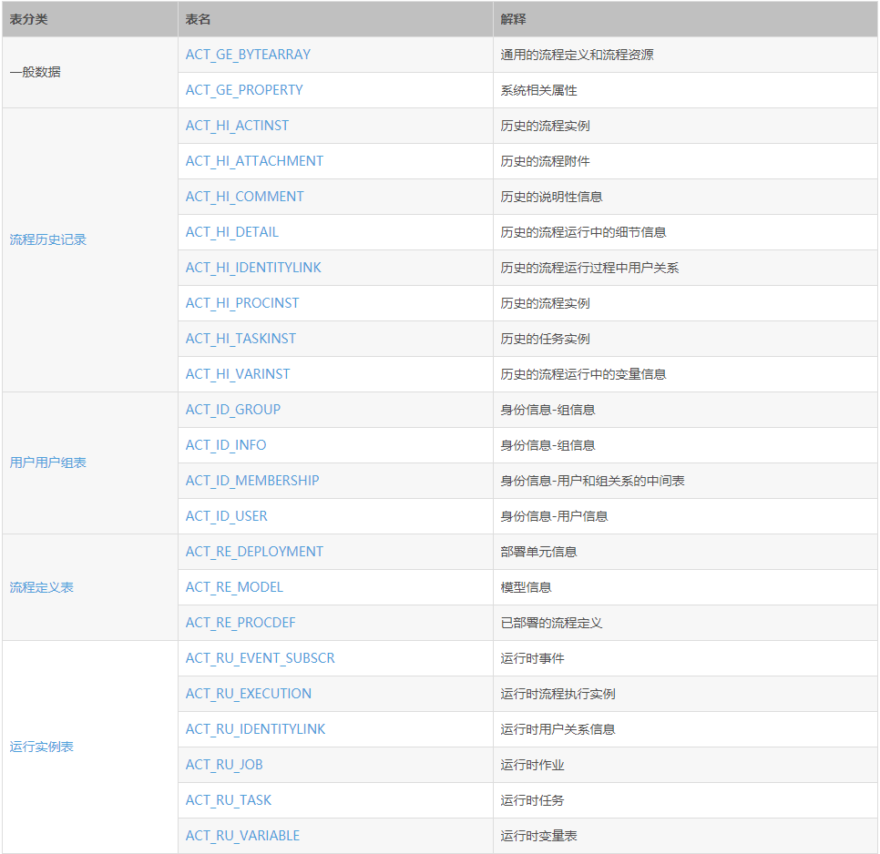

###### 1.历史表

**表名:ACT_HI_PROCINST（历史流程实例信息）**

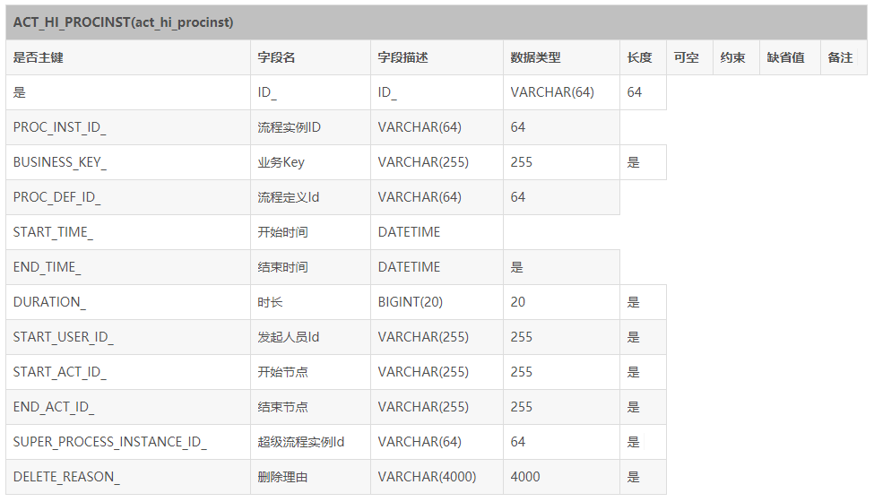

**表名：ACT_HI_ACTINST（历史节点表）**

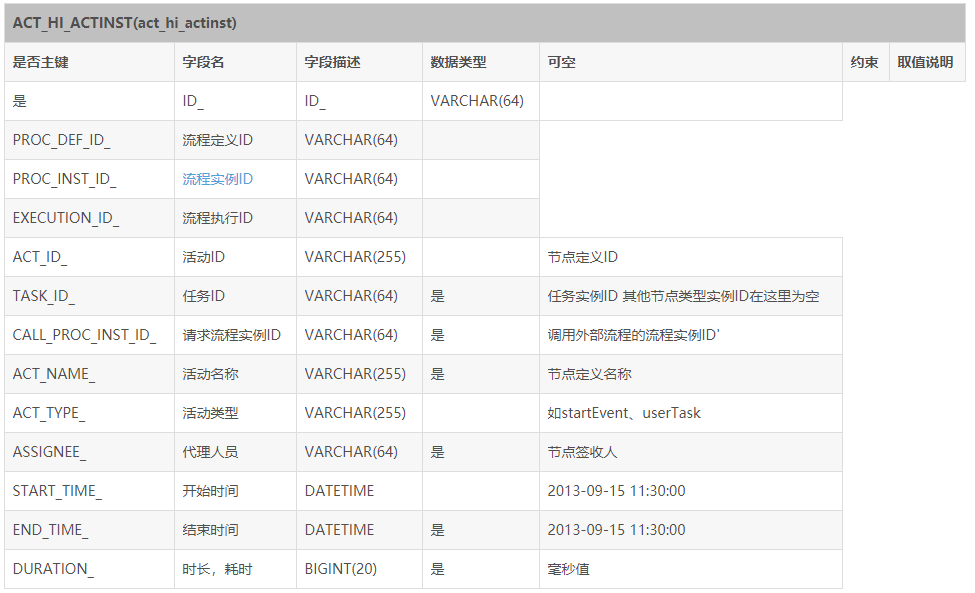

**表名:ACT_HI_TASKINST（历史任务流程实例信息）**

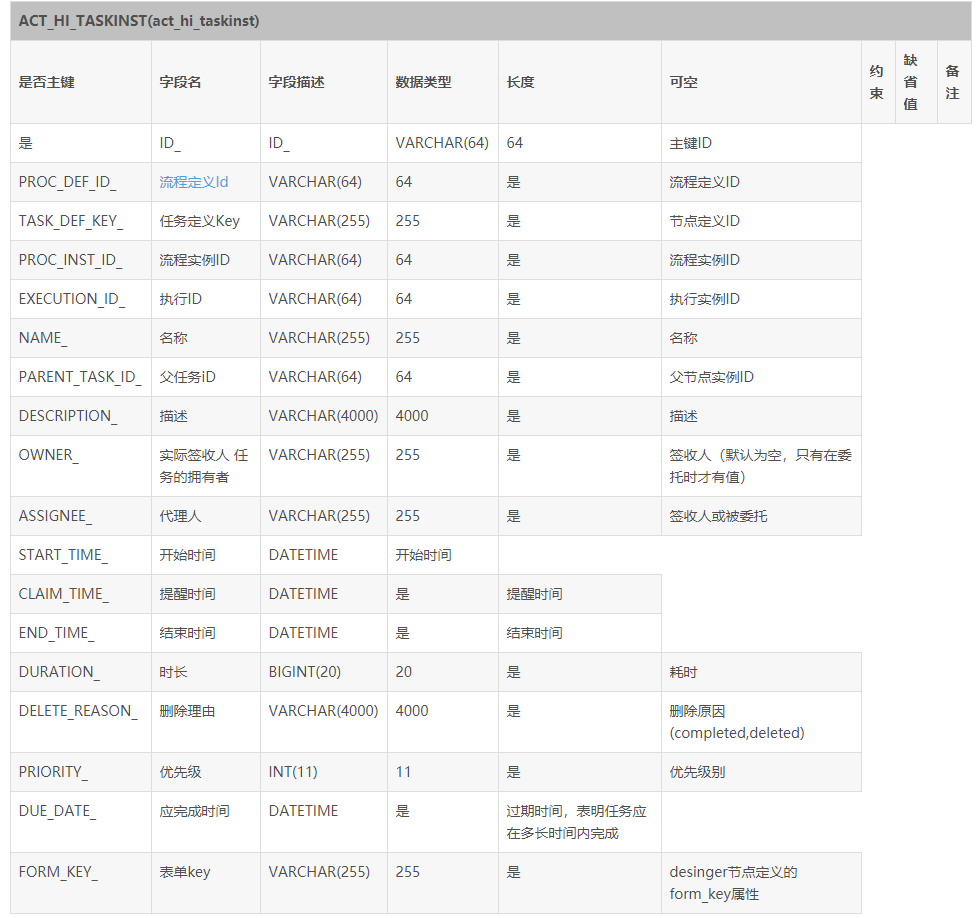

 **表名:ACT_HI_COMMENT（历史审批意见表）**

记录所有节点的审批意见

**表名:ACT_HI_VARINST（历史变量信息）**

所有审批过程用到的变量（画流程图过程中自定义的）

**表名：ACT_HI_IDENTITYLINK（历史人员记录表）**

所有审批过程参与的人员信息（重复参与不记录）


###### 2.资源库流程规则表

**表名:ACT_RE_DEPLOYMENT（部署信息表）**

部署模型时候记录

**表名:ACT_RE_MODEL(流程设计模型表)**

创建模型时候记录

**表名:ACT_RE_PROCDEF（流程定义：解析表）**

由模型所创建的审批流程

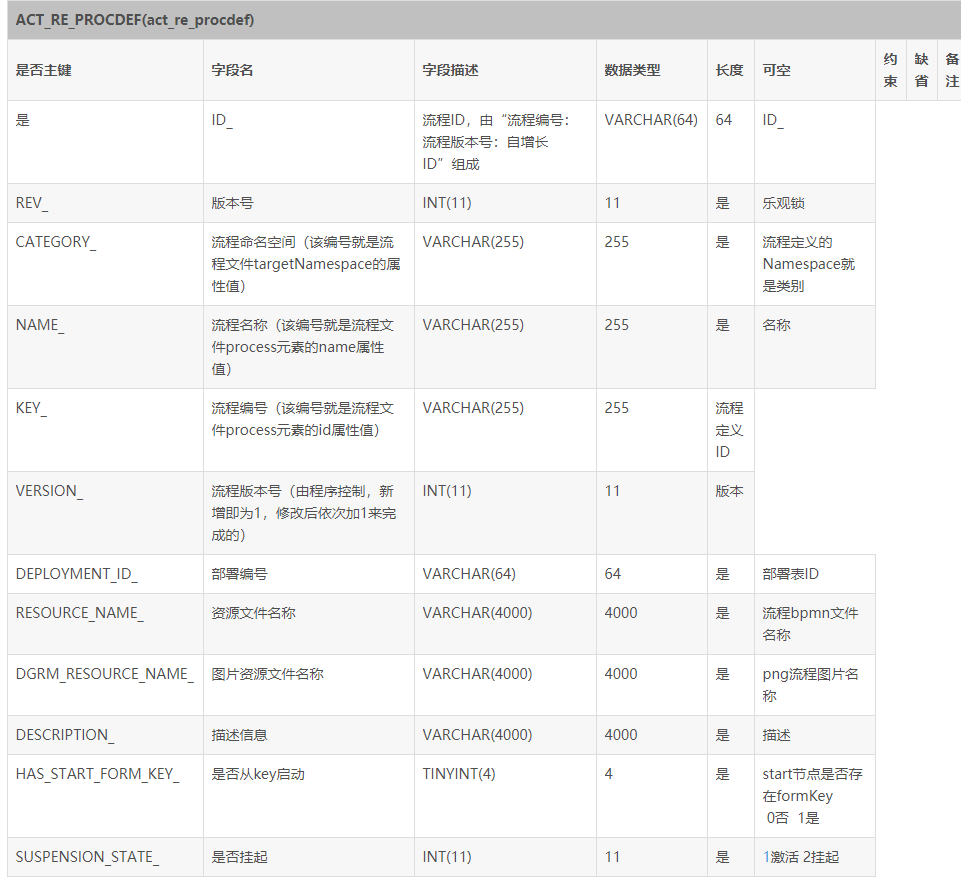

'RE'表示repository。 这个前缀的表包含了流程定义和流程静态资源 （图片，规则，等等）。

此表和ACT_RE_DEPLOYMENT是多对一的关系，即，一个部署的bar包里可能包含多个流程定义文件，每个流程定义文件都会有一条记录在ACT_RE_PROCDEF表内，每个流程定义的数据，都会对于ACT_GE_BYTEARRAY表内的一个资源文件和PNG图片文件。和ACT_GE_BYTEARRAY的关联是通过程序用ACT_GE_BYTEARRAY.NAME与ACT_RE_PROCDEF.NAME_完成的，在数据库表结构中没有体现。

###### 3.运行时数据库表

**表名:ACT_RU_EXECUTION（运行时流程执行实例）**

我的代办任务查询表（发起的某一审批流程实例）

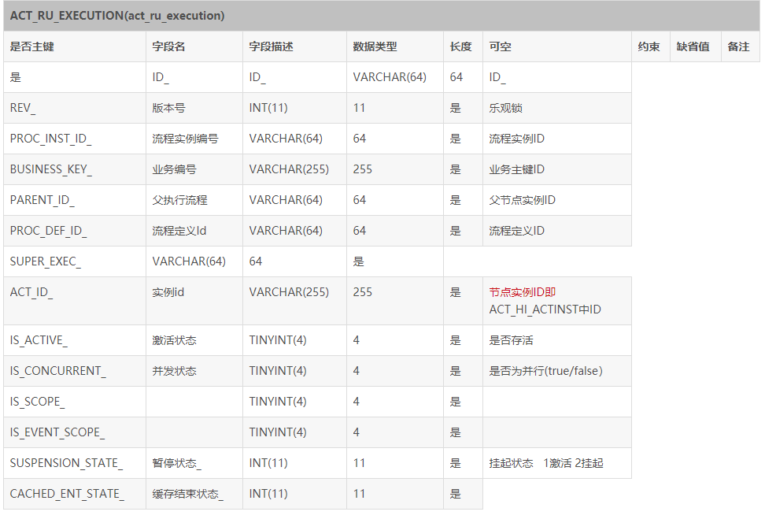

**表名:ACT_RU_TASK(运行时任务数据表)**

代办任务查询表：某一审批流程下的，某一节点的审批任务

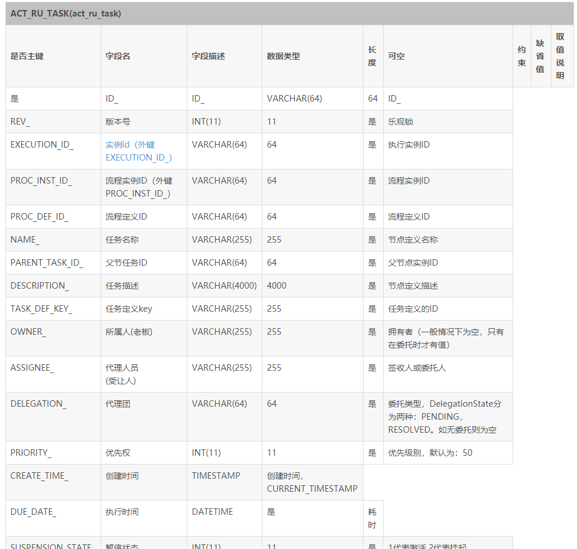


**表名:ACT_RU_VARIABLE (运行时流程变量数据表)**


**表名:ACT_RU_IDENTITYLINK（运行时身份联系）**

存储当前节点参与者的信息,任务参与者数据表。

任务Id ： TASK_ID_

流程实例ID ：PROC_INST_ID_

流程定义Id ： PROC_DEF_ID_


##### 二、Activiti中流程对象之间的关系

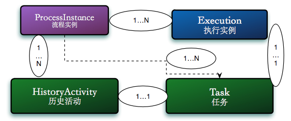


> 注意：`REV_`字段是版本号，每更新一次该条数据，版本号加一 ，ID 是按照表格建立数据条目的顺序递增的

##### 三、模型的建立与管理

**1.创建模型接口：**（`/model/create`）

表格：`act_re_model`（记录所创建的模型）、`act_ge_bytearray`（记录二进制数据集合）

（`act_re_model`表的）`EDITOR_SOURCE_VALUE_ID_`字段是`act_ge_bytearray`的主键

（`act_re_model`表的）`CATEGORY_` 是自定义策略（用户自己对流程模型的分类）

**2.画流程图&保存流程图：**

`act_ge_bytearray`新增一条数据，`act_re_model`的`EDITOR_SOURCE_EXTRA_VALUE_ID_`字段关联该表新增的数据`ID`

每点一次保存，`act_re_model`表就更新一次，`REV_` + 1


**3.模型部署操作接口：**（`/model/{modelId}/deploy`）

1.`act_re_procdef`新增一条数据，`act_re_deployment`新增一条数据，其中字段`DEPLOYMENT_ID`为部署编号，两表关联;

2.生成资源文件（`XXX.bpmn.xml`）`RESOURCE_NAME_`，以及图片资源文件(`XXX.[process].png`) `DGRM_RESOURCE_NAME_`，并且将文件按照二进制存储在`act_ge_bytearray`中,以`act_ge_bytearray`表的`DEPLOYMENT_ID`字段关联;

3.`act_re_model` 更新 `DEPLOYMENT_ID_`字段，关联当前的`act_re_procdef`数据；

注意：`act_re_procdef` 的 `Key`字段

`ID  = process:1:7   --- process代表流程实例的key，1 代表模型ID， 7 是自己的ID（Auto）`

**其他接口：**

`/model/export/{modelId}`  --- 到处model的XML文件

`/model/modelList` -- 查看定义的model

`/model/processImage` -- 流程实例化以后查看流程节点情况图像


> 模型部署完成，等待实例化流程:一旦有人启动流程就相当于实例化了


##### 四、流程控制：

###### **开始流程**（初始化）(`/flow/start`)

**业务上，“员工” 提交到了 “ 直属经理” （相当于初始化 + 第一次审批提交）**

**1.**`act_ru_execution`运行时流程执行实例表新增一条数据：

`PROC_DEF_ID_`字段关联`act_re_procdef`流程定义数据表的`ID`

本身`ID` 和 `PROC_INST_ID_` 一样

`act_hi_procinst`（历史流程实例信息）添加数据，与当前`act_ru_execution` 信息一致

**2.**`act_hi_actinst`历史节点表新增一条数据： “开始”节点

`PROC_DEF_ID_ 、PROC_INST_ID_、EXECUTION_ID_`关联 `act_ru_execution` 和 `act_re_procdef`的对应字段

`ACT_TYPE_ = startEvent`代表开始节点

`TASK_ID_`（任务ID）--- `act_hi_taskinst` 的ID

`ACT_ID_` 生成， 同时更新`act_ru_execution`中的`ACT_ID_`  （保持当前审批节点`ACT_ID_`与`act_ru_execution`一致）

`START_TIME_` 和 `END_TIME_` 对应审批提交开始时间和结束时间

`ASSIGNEE_` 代表审批操作人员

**3.**`act_hi_actinst`历史节点表新增一条数据： “员工”节点，下面进行“员工提交”操作(默认)

`act_hi_actinst（TASK_ID_）` --- `act_hi_taskinst(ID)`

**4.**`act_ru_task`运行时任务数据表--(理论上是新增了一条关于“员工节点”的任务数据，然后默认进行删除)

`act_hi_taskinst`历史任务流程实例信息表新增一条数据：“员工”历史任务 

> 注意：`act_ru_task` 与 `act_hi_taskinst` 属于一一对应关系

`ID`  --- `act_hi_actinst（TASK_ID_）`

`PROC_DEF_ID_ -- act_re_procdef （ID）`

`TASK_DEF_KEY_ -- act_hi_actinst`（当前对应节点数据的`ACT_ID_`）

`PROC_INST_ID_ --  act_ru_execution(PROC_INST_ID_)`

`EXECUTION_ID_ -- act_ru_execution(ID)`

`START_TIME_` -- 开始时间

`END_TIME_` -- 结束时间

**5.**`act_hi_comment`历史意见表添加数据：

`TASK_ID_` -- 对应一次处理的任务的ID  （`act_ru_task` 与 `act_hi_taskinst`）

`PROC_INST_ID_` -- `act_ru_execution (PROC_INST_ID_)`

`USER_ID_`  -- 操作用户信息

`MESSAGE_` -- 提交意见保存信息

**6.**`act_ru_variable` (运行时流程变量数据表)  、`act_hi_varinst`（历史变量表） 

--  处理自定义的变量  `NAME_ = apply_status` , 

> 两张表属于一一对应关系（ID 一致）

`PROC_INST_ID_` -- `act_ru_execution (PROC_INST_ID_)`

`EXECUTION_ID_` -- act_ru_execution(ID)

`TASK_ID_` -- 

**7.**`act_ru_identitylink`(运行时流程人员表，主要存储任务节点与参与者的相关信息)、`act_hi_identitylink`(历史流程人员表)

> -- 两表一一对应关系（ID一致）

`PROC_INST_ID_ -- act_ru_execution (PROC_INST_ID_)`

`PROC_DEF_ID_ -- `

`TASK_ID_ --`

**8.**`act_hi_actinst`历史节点表  --  新增“直属经理”节点

新的`ACT_ID_`

同时`TASK_ID_`  关联 `TASK_ID_`  与 `act_hi_taskinst`  的 `ID`

**9.**`act_ru_task`运行时任务数据表   -- （执行中实时任务）代办任务查询表

记录了当前流程所在审批节点的信息

新增关于“直属经理”的节点任务  （当前审批节点）

`act_hi_taskinst`（历史任务流程实例信息表）

`EXECUTION_ID_、PROC_INST_ID_、PROC_DEF_ID_`

`TASK_DEF_KEY_ -- act_hi_actinst（ACT_ID_）`

`NAME_ = 直属经理`

`CREATE_TIME_（任务创建时间）、DUE_DATE_（任务执行时间）`


> 至此，初始化 和 员工默认提交请假申请到直属经理的流程完成

###### **提交操作**（审批通过）  

**直属经理审批通过**

**1.**`act_hi_comment` 历史意见表添加数据

`TASK_ID_` 关联任务（`act_ru_task 、act_hi_taskinst`） 的`ID`

`act_hi_taskinst` 历史任务流程实例信息表，更新关于“**直属经理**”的操作信息：

`END_TIME_` -- 审批完成时间

**2.** `act_ru_identitylink 、act_hi_identitylink`  (运行时、历史人员表) 添加数据

关于“**直属经理**”用户的一些信息存储

**3.**`act_hi_actinst`（历史节点表） 写入节点 “**部门主管**”，同时生成`ACT_ID_`

`START_TIME_` 记录该节点入手处理任务的时间

`ACT_TYPE_ = userTask`

**4.** `act_ru_task` （运行时任务数据表，我的待办）写入“**部门主管**”的当前任务数据

`TASK_DEF_KEY_ 关联 act_hi_actinst 的 ACT_ID_`

`act_hi_taskinst`（历史任务流程实例信息表）新增一条对应的 “**部门主管** ”的任务信息（`ID`一致）


###### **部门主管审批通过（终审）**

前面步骤与“**直属经理**” `1、2`步骤一致

部门主管**终审** -- 流程结束：

`act_hi_actinst`（历史节点表） 写入节点 “**结束**”，同时生成`ACT_ID_`

`START_TIME_` 记录该节点进入的时间

`ACT_TYPE_ = endEvent`

终审结束，更新`act_hi_procinst`（历史流程实例信息）

`START_ACT_ID_`  -- 开始的节点ACT_ID_

`END_ACT_ID_` -- 结束的节点ACT_ID_


###### **直属经理审批驳回**

**1.**`act_hi_comment` 历史意见表添加数据：审批意见

`act_hi_taskinst` 历史任务流程实例信息表，更新关于“**直属经理**”的操作信息：

审批结束时间

**2.** `act_ru_identitylink 、act_hi_identitylink`  (运行时、历史人员表) 添加数据

关于“**直属经理**”用户的一些信息存储

**3.**`act_hi_actinst`（历史节点表） 写入驳回目标节点 “**员工**”，同时生成`ACT_ID_`

`START_TIME_` 记录该节点入手处理任务的时间

`TASK_ID_` 关联`act_ru_task表`任务ID

**4.** `act_ru_task` （运行时任务数据表，我的待办）写入“**员工**”的当前任务数据

`TASK_DEF_KEY_ 关联 act_hi_actinst 的 ACT_ID_`

`act_hi_taskinst`（历史任务流程实例信息表）新增一条对应的 “**员工** ”的任务信息（`ID`一致）


> 注意：

**1**.`act_ru_variable （运行时流程变量数据表）、act_hi_varinst（历史变量表）`

运行时变量表只记录关于节点审批时候的自定义的变量情况（一次审批过程中，变量可能有多个）

历史表记录了所有审批的变量使用情况

**2**.`act_ru_identitylink（运行时流程人员表）、act_hi_identitylink（历史流程人员表）`

运行时人员表只记录关于本次审批过程的人员参数情况（所有不同的人员，相同人员只记录一次）

历史人员表记录了所有审批过程的人员情况

当被驳回的流程再次提交到原先存在的节点上时，该表不会发生新增操作

**3**.`act_hi_comment（历史意见表）`

每一个节点的审批意见都会进行记录


> 注意：目前的简单审批流程没有遇到的表格

`act_hi_attachment（历史附件表）`

`act_hi_detail（历史详情表，提供历史变量的查询）`

历史详情表：流程中产生的变量详细，包括控制流程流转的变量，业务表单中填写的流程需要用到的变量等。


`act_ru_event_subscr（运行时事件）`

`act_ru_job （运行时作业）`

运行时定时任务数据表


`act_evt_log`

`act_procdef_info` 


> 并行任务模拟：

一号实例：INST_ID  = 5001


##### 五、核心API

（根据核心API组装业务需要的工作流接口）

###### 5.1 ProcessEngine

在Activiti中最核心的类，其他的类都是由他而来。

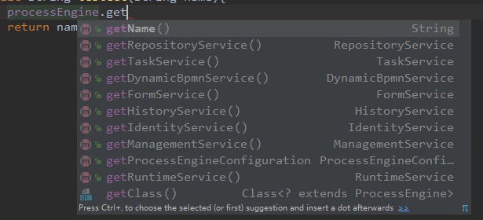

各个service的作用：

| **RepositoryService** | 管理流程定义                                 |
| --------------------- | -------------------------------------------- |
| **RuntimeService**    | 执行管理，包括启动、推进、删除流程实例等操作 |
| **TaskService**       | 任务管理                                     |
| **HistoryService**    | 历史管理(执行完的数据的管理)**               |
| **IdentityService**   | 组织机构管理                                 |
| FormService           | 一个可选服务，任务表单管理                   |
| ManagerService        |                                              |

###### 5.2 ProcessInstance

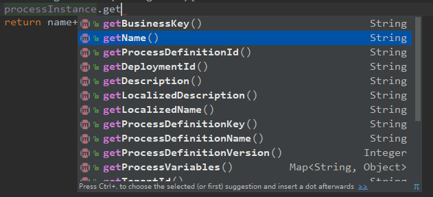

我们可以利用这个对象来了解当前流程实例的进度等信息。流程实例就表示一个流程从开始到结束的最大的流程分支，即一个流程中流程实例只有一个。对应表格 act_re_procdef ，查询的基本是该表格的配置字段。

5.3 RuntimeService

Activiti的流程执行服务类。可以从这个服务类中获取很多关于流程执行相关的信息。

```java
// 实例化一个流程 - 启动流程
ProcessInstance processInstance = runtimeService.startProcessInstanceByKey(key);
String procInstId = processInstance.getId();
```

5.4 TaskService

最核心的API，操作某一流程实例中任一环节的任务

```java
// 获取当前任务
TaskEntity taskEntity = (TaskEntity) taskService.createTaskQuery()
        .processInstanceId(instId)
        .active()
        .singleResult();
```

```java
// 完成任务且添加comment，同时设置variables流程相关的变量
taskService.addComment(taskId, procInstanceId, comment);
taskService.complete(taskId, variables);
```

5.5 RepositoryService

Activiti的仓库服务类。所谓的仓库指流程定义文档的两个文件：bpmn文件和流程图片。


5.6 HistoryService

Activiti的查询历史信息的类。在一个流程执行完成后，这个对象为我们提供查询历史信息。


##### 六、两大监听器

疑问：当我们流程流转到某一节点、某一连线或者流程开始和结束的时候我们怎么添加一些业务处理呢？

全局监听、连线监听、节点监听

节点既可以配置执行监听，又可以配置任务监听

- 全局监听器主要使用的场景就是监控这个流程的启动和结束。流程开始的时候可以监控，流程结束的时候可以监控，这里说的是流程实例启动结束的监控，并非是流程引擎的启动结束监控。流程引擎的启动结束监控可以参考http://blog.csdn.net/qq_30739519/article/details/51217614 不要混淆了这些概念。

- 当节点结束的时候，经过连线的时候，我们可以在线上定义类，实现自己的业务逻辑。
- 节点监听器：一般指任务监听器

###### 1.执行监听器（ Execution listener）

在流程实例执行的过程中触发某个**事件**时，执行监听器允许你去执行额外的java代码或者对指定的表达式求值。可以被捕捉的事件有：

- Start and ending of a process instance.
- Taking a transition.
- Start and ending of an activity.
- Start and ending of a gateway.
- Start and ending of intermediate events.
- Ending a start event or starting an end event.

ExecutionListener定义如下：流程实例start、end、take的时候调用。take是监控连线的时候使用的。

```java
public interface ExecutionListener extends Serializable {
  String EVENTNAME_START = "start";
  String EVENTNAME_END = "end";
  String EVENTNAME_TAKE = "take";
  void notify(DelegateExecution execution) throws Exception;
}
```

###### 2.任务监听器（Task listener）

```java
public interface TaskListener extends Serializable {
  String EVENTNAME_CREATE = "create";
  String EVENTNAME_ASSIGNMENT = "assignment";
  String EVENTNAME_COMPLETE = "complete";
  String EVENTNAME_DELETE = "delete";
  String EVENTNAME_ALL_EVENTS = "all";
  void notify(DelegateTask delegateTask);
}
```

###### 3.监听中获取spring-ioc中对象

使用spring最原始的获取IOC对象的方式

```java
@Component
@Slf4j
public class MyTestListener implements TaskListener {
	// 要获取的service对象
	private TestService testService;
	@Override
	public void notify(DelegateTask delegateTask) {
    	log.info("自定义测试任务监听器 ------------------->>>测试外部服务注入");
    	// 调用工具类中的getBean方法，直接从IOC中获取操作对象
    	testService = SpringContextHolder.getBean(TestService.class);
    	log.info(testService.testGet("Lily"));
    
    	String eventName= delegateTask.getEventName();
    	if("create".equals(eventName)){
        	log.info("create事件触发-------------->>");
    	}
	}
}
```

下面是工具类：

```java
import lombok.extern.slf4j.Slf4j;
import org.apache.commons.lang3.Validate;
import org.springframework.beans.factory.DisposableBean;
import org.springframework.context.ApplicationContext;
import org.springframework.context.ApplicationContextAware;
import org.springframework.stereotype.Component;

@Component
@Slf4j
public class SpringContextHolder implements ApplicationContextAware, DisposableBean {
    private static ApplicationContext applicationContext = null;
    /**
     * 取得存储在静态变量中的ApplicationContext.
     */
    public static ApplicationContext getApplicationContext() {
        assertContextInjected();
        return applicationContext;
    }
    /**
     * 从静态变量applicationContext中取得Bean, 自动转型为所赋值对象的类型.
     */
    @SuppressWarnings("unchecked")
    public static <T> T getBean(String name) {
        assertContextInjected();
        return (T) applicationContext.getBean(name);
    }
    /**
     * 从静态变量applicationContext中取得Bean, 自动转型为所赋值对象的类型.
     */
    public static <T> T getBean(Class<T> requiredType) {
        assertContextInjected();
        return applicationContext.getBean(requiredType);
    }
    /**
     * 清除SpringContextHolder中的ApplicationContext为Null.
     */
    public static void clearHolder() {
        log.debug("清除SpringContextHolder中的ApplicationContext:"
                + applicationContext);
        applicationContext = null;
    }
    /**
     * 实现ApplicationContextAware接口, 注入Context到静态变量中.
     */
    @Override
    public void setApplicationContext(ApplicationContext applicationContext) {
//        log.debug("注入ApplicationContext到SpringContextHolder:{}", applicationContext);
        if (SpringContextHolder.applicationContext != null) {
            log.warn("SpringContextHolder中的ApplicationContext被覆盖, 原有ApplicationContext为:" + SpringContextHolder.applicationContext);
        }
        SpringContextHolder.applicationContext = applicationContext; // NOSONAR
    }
    /**
     * 实现DisposableBean接口, 在Context关闭时清理静态变量.
     */
    @Override
    public void destroy() throws Exception {
        SpringContextHolder.clearHolder();
    }
    /**
     * 检查ApplicationContext不为空.
     */
    private static void assertContextInjected() {
        Validate.validState(applicationContext != null, "applicaitonContext属性未注入, 请在applicationContext.xml中定义SpringContextHolder.");
    }
}
```

##### 七、开发注意事项

1.在绘制流程图过程中，节点ID和节点连线ID 须要自定义（指定命名规范），填写节点和连线名称，必要时填写描述信息。(禁止使用activiti自己生成的ID串)


节点ID命名建议：`node_流程名简写_节点名_节点序号`

例如，恒宝流程的申请提报节点： `node_g_apply_a01`

连线ID命名建议：`route_流程名简写_连线名_连线序号`

例如，恒宝流程的申请提报节点到风控预审的连线： `route_g_applyToys_a01`

恒宝流程的申请提报节点到完善材料的连线： `route_g_applyTows_a02`

2.节点操作人动态赋值？？


3.动态部署和配置流程模型（删除或者新增节点）？


4.流程流转状态码的定义（连线的状态码）？


5.节点状态码定义（是否要做统一标准，还是一套流程一套码）

为了扩展性，建议采用“标志命名”，例如，申请提报节点状态码为`sqtb_01`,下一个节点为完善材料，状态码为`wscl_01`。如果将来在申请提报和完善材料直接新增一个节点，可以为`xxx_01`

或者采用“跳跃式命名”，A 节点 `a_001`, 下一节点B节点 `a_010`，如果A和B之间有新增节点，可以命名为`a_002`,一直扩展到`a_009`，再扩展就要叫`b_001`


6.工作流连接导线（路由）----如果删除一条线再重新画的话，就会重新生成新的ID，造成新旧数据冲突


